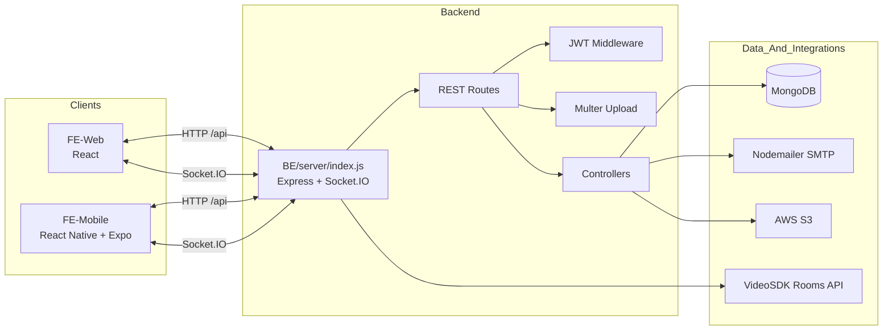
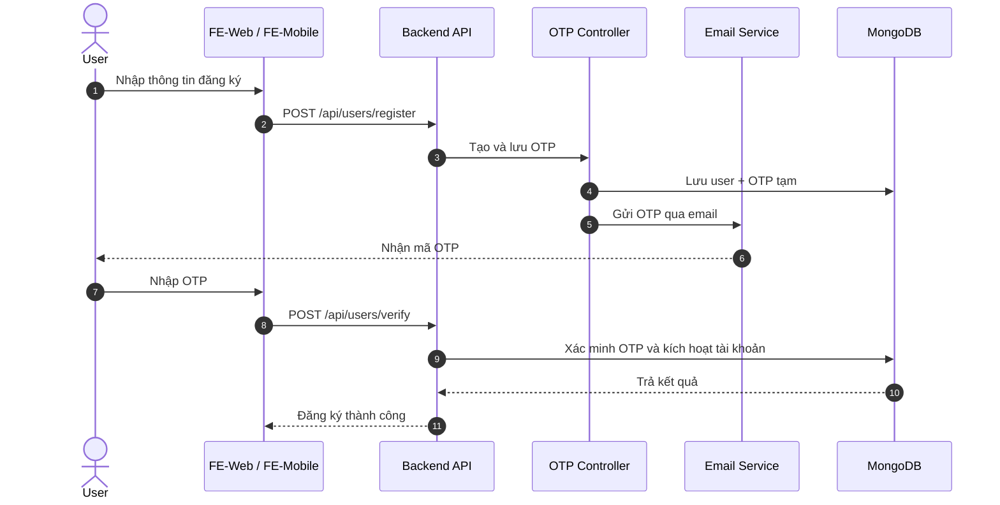
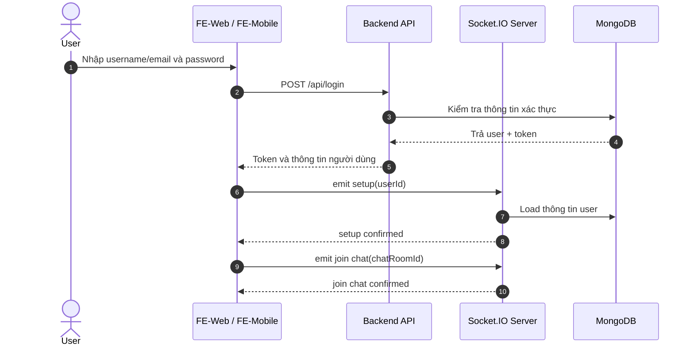
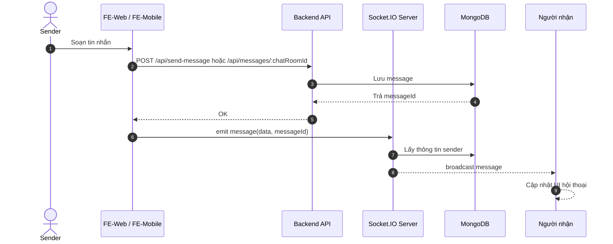
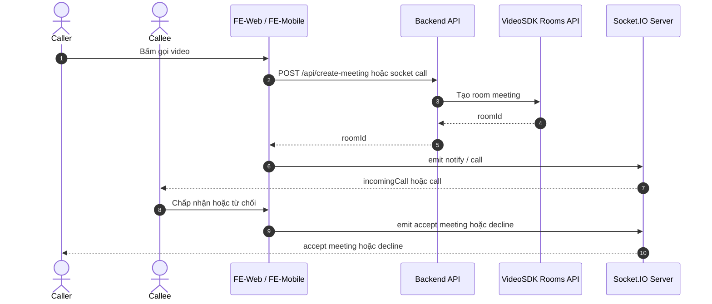

# CNM-ZELOO Technical Documentation

CNM-ZELOO là hệ thống nhắn tin realtime đa nền tảng gồm Backend Node.js/Express, Web React và Mobile React Native/Expo. Hệ thống hỗ trợ chat 1-1, chat nhóm, gửi media, location, reaction, unsend, quản lý bạn bè, OTP, gọi meeting và đồng bộ realtime qua Socket.IO.

## 1. Tổng quan hệ thống

### 1.1 Mục tiêu

- Cung cấp nền tảng chat realtime cho web và mobile.
- Hỗ trợ giao tiếp đồng bộ giữa HTTP API và Socket.IO.
- Tích hợp chức năng xác thực, quản lý bạn bè, nhóm chat và meeting video.
- Lưu trữ dữ liệu người dùng, hội thoại và tin nhắn trong MongoDB.
- Hỗ trợ upload media và gửi email OTP.

### 1.2 Phạm vi chức năng

- Xác thực người dùng: đăng ký, đăng nhập, OTP, quên mật khẩu, đổi mật khẩu.
- Quản lý hồ sơ: cập nhật thông tin, ảnh đại diện.
- Bạn bè: gửi lời mời, chấp nhận, hủy, hủy kết bạn, danh sách bạn bè.
- Nhóm: tạo nhóm, thêm/xóa thành viên, rời nhóm, phân quyền.
- Tin nhắn: text, media, location, reply, reaction, pin, unsend, xóa, forward, vote.
- Realtime: message, notification, call, accept/decline meeting.
- Meeting: tạo phòng họp qua VideoSDK.

## 2. Kiến trúc tổng thể



### 2.1 Các thành phần chính

- Backend khởi chạy từ [BE/server/index.js](BE/server/index.js) và gắn cả Express lẫn Socket.IO trên cùng một tiến trình.
- REST API được nhóm qua [BE/server/routes/site.js](BE/server/routes/site.js).
- FE-Web dùng axios client tại [FE-Web/src/api/axiosClient.js](FE-Web/src/api/axiosClient.js).
- FE-Mobile cấu hình base URL tại [FE-Mobile/config.js](FE-Mobile/config.js).
- Meeting được tạo từ API VideoSDK trong [BE/server/api.js](BE/server/api.js).

## 3. Công nghệ sử dụng

### 3.1 Backend

- Node.js
- Express
- MongoDB, Mongoose
- Socket.IO
- JWT
- bcrypt
- Multer
- Nodemailer
- AWS SDK S3
- Joi, Validator

### 3.2 Web

- React 18
- React Router DOM v6
- Axios
- Socket.IO Client
- React Bootstrap, Bootstrap 5
- SASS / SCSS
- React Toastify
- VideoSDK React SDK

### 3.3 Mobile

- React Native 0.79
- Expo 53
- React Navigation v7
- Axios
- Socket.IO Client
- AsyncStorage
- Expo Image Picker, Expo AV, Expo Location

## 4. Cấu trúc repository

```text
CNM-ZELOO/
├── BE/
│   └── server/
│       ├── controllers/
│       ├── middleware/
│       ├── models/
│       ├── routes/
│       ├── utils/
│       ├── api.js
│       └── index.js
├── FE-Web/
│   └── src/
│       ├── api/
│       ├── components/
│       ├── configs/
│       ├── layout/
│       ├── pages/
│       └── GlobalStyle/
└── FE-Mobile/
    ├── screens/
    ├── App.js
    └── config.js
```

## 5. Module backend

### 5.1 Entry point và runtime

- `npm start` trong BE chạy `nodemon --inspect server/index.js`.
- Server kết nối MongoDB trước khi mở cổng HTTP.
- Express dùng `cors`, `body-parser` và router chính.
- Socket.IO được gắn trực tiếp lên HTTP server.
- Hiện tại server lắng nghe trên port `3000` cố định trong code.

### 5.2 Router

Tất cả route REST được mount dưới tiền tố `/api`.

- Xác thực: register, login, OTP, reset password.
- Profile: lấy/cập nhật hồ sơ, avatar.
- Friend: add, accept, cancel, unfriend.
- Group: create, add member, delete member, out group, grant permission.
- Direct chat: direct rooms, chat room mapping.
- Message: get, send, media, location, reaction, pin, unsend, delete, vote.

### 5.3 Dữ liệu chính

- `user`: thông tin tài khoản, trạng thái online, danh sách bạn bè.
- `chatRoom`: phòng chat direct/group.
- `message`: nội dung tin nhắn, media, reaction, reply, pin, unsent.
- `group` và `groupDetail`: dữ liệu nhóm và thành viên.
- `direct`: mapping cho hội thoại 1-1.
- `otpModel`: OTP đăng ký và OTP quên mật khẩu.

## 6. Web application

### 6.1 Khởi động

- Web dùng `react-scripts start`, `build`, `test`, `eject`.
- API base URL lấy từ `REACT_APP_API_URL`, nếu không có sẽ fallback sang deployment mặc định.
- Auth token được gắn vào header từ cookie `authToken`.

### 6.2 Routing chính

- Trang home, register, forgot password, reset password.
- Chat và meeting.
- Friend request, friend list, recall friend request.

### 6.3 Socket usage

- Kết nối socket sau khi có user ID.
- Join phòng chat theo `chatRoomId`.
- Nhận message, unsend, react, notify, incomingCall, accept meeting, decline.

## 7. Mobile application

### 7.1 Khởi động

- Mobile dùng Expo CLI.
- Stack navigator điều hướng qua login, register, OTP, chat, profile, friend list và news.
- API base URL cấu hình trong [FE-Mobile/config.js](FE-Mobile/config.js).

### 7.2 Giao tiếp realtime

- Mobile emit `setup` khi có payload user ID.
- Join chat room bằng `join chat`.
- Lắng nghe message và incomingCall qua Socket.IO.

## 8. Cài đặt và chạy local

### 8.1 Yêu cầu

- Node.js 18+.
- MongoDB 6+ hoặc MongoDB tương thích.
- npm.
- Expo Go hoặc Expo CLI cho mobile.

### 8.2 Backend

```bash
cd BE
npm install
```

Tạo file `.env`:

```env
PORT=3000
MONGO_URL=mongodb://127.0.0.1:27017/zeloo
JWT_SECRET=your_jwt_secret_key
EMAIL_USER=your_email@gmail.com
EMAIL_PASSWORD=your_app_password
AWS_ACCESS_KEY_ID=your_access_key
AWS_SECRET_ACCESS_KEY=your_secret_key
AWS_REGION=your_region
AWS_BUCKET_NAME=your_bucket_name
```

Chạy backend:

```bash
npm start
```

Lưu ý: code hiện tại đang listen cố định ở port `3000` trong mã nguồn, nên nếu đổi `PORT` trong `.env` thì cần đồng bộ lại implementation.

### 8.3 Web

```bash
cd FE-Web
npm install
```

Tạo file `.env`:

```env
REACT_APP_API_URL=http://localhost:3000
REACT_APP_SOCKET_URL=http://localhost:3000
```

Chạy web:

```bash
npm start
```

Khuyến nghị chạy web ở cổng khác `3000` để tránh xung đột với backend, ví dụ `3001`.

### 8.4 Mobile

```bash
cd FE-Mobile
npm install
```

Cập nhật `config.js` nếu backend không chạy ở URL mặc định:

```js
export const BASE_URL = "http://localhost:3000";
```

Chạy Expo:

```bash
npm start
```

Hoặc:

```bash
npx expo start
```

## 9. Cấu hình tích hợp ngoài

### 9.1 MongoDB

- Tạo database `zeloo` hoặc tên tương đương.
- Cập nhật `MONGO_URL` trong `.env`.

### 9.2 Email OTP

- Sử dụng SMTP qua Nodemailer.
- Với Gmail nên dùng App Password thay vì mật khẩu chính.

### 9.3 AWS S3

- Dùng để lưu trữ file media.
- Cần cấu hình access key, secret key, region và bucket.

### 9.4 VideoSDK

- Dùng để tạo room meeting.
- Backend gọi trực tiếp `POST https://api.videosdk.live/v2/rooms` để tạo `roomId`.

## 10. API chính

### 10.1 Authentication

| Method | Path                                  | Mô tả                          |
| ------ | ------------------------------------- | ------------------------------ |
| POST   | `/api/users/register`                 | Đăng ký tài khoản              |
| POST   | `/api/login`                          | Đăng nhập                      |
| POST   | `/api/users/send-otp`                 | Gửi OTP đăng ký                |
| POST   | `/api/users/verify`                   | Xác minh OTP đăng ký           |
| POST   | `/api/users/forgot-password`          | Khởi tạo quên mật khẩu         |
| POST   | `/api/users/send-reset-passwordOTP`   | Gửi OTP reset mật khẩu         |
| POST   | `/api/users/verify-reset-passwordOTP` | Xác minh OTP reset mật khẩu    |
| POST   | `/api/users/update-password`          | Cập nhật mật khẩu mới          |
| POST   | `/api/user/change-password`           | Đổi mật khẩu sau khi đăng nhập |

### 10.2 Profile và friend

| Method | Path                         | Mô tả               |
| ------ | ---------------------------- | ------------------- |
| GET    | `/api/profile`               | Lấy hồ sơ hiện tại  |
| POST   | `/api/profile`               | Cập nhật hồ sơ      |
| POST   | `/api/profile/avatar`        | Cập nhật avatar     |
| POST   | `/api/add-friend`            | Gửi lời mời kết bạn |
| POST   | `/api/accept-friend`         | Chấp nhận kết bạn   |
| GET    | `/api/getAllFriendRequest`   | Danh sách lời mời   |
| GET    | `/api/getAllFriend`          | Danh sách bạn bè    |
| POST   | `/api/cancel-friend-request` | Hủy lời mời         |
| POST   | `/api/unfriend`              | Hủy kết bạn         |

### 10.3 Chat và message

| Method | Path                        | Mô tả                        |
| ------ | --------------------------- | ---------------------------- |
| GET    | `/api/messages/:chatRoomId` | Lấy tin nhắn theo phòng chat |
| POST   | `/api/messages/:chatRoomId` | Gửi tin nhắn                 |
| POST   | `/api/send-message/`        | Gửi tin nhắn                 |
| POST   | `/api/send-media/`          | Gửi media                    |
| POST   | `/api/send-location`        | Gửi vị trí                   |
| PATCH  | `/api/unsent-message/:id`   | Thu hồi tin nhắn             |
| PATCH  | `/api/react-message/:id`    | Reaction tin nhắn            |
| PATCH  | `/api/pin-message/:id`      | Ghim tin nhắn                |
| PATCH  | `/api/unpin-message/:id`    | Bỏ ghim tin nhắn             |
| DELETE | `/api/message/:id`          | Xóa tin nhắn                 |
| POST   | `/api/create-vote`          | Tạo vote                     |
| POST   | `/api/cast-vote`            | Tham gia vote                |

### 10.4 Group

| Method | Path                                    | Mô tả                |
| ------ | --------------------------------------- | -------------------- |
| POST   | `/api/creategroup`                      | Tạo nhóm             |
| POST   | `/api/groups/:chatRoomId/add-member`    | Thêm thành viên      |
| POST   | `/api/groups/:chatRoomId/delete-member` | Xóa thành viên       |
| POST   | `/api/groups/:chatRoomId/outGroup`      | Rời nhóm             |
| POST   | `/api/grant-permission`                 | Cấp quyền thành viên |
| DELETE | `/api/delete-group/:groupId`            | Xóa nhóm             |

## 11. Socket.IO events

### 11.1 Client -> Server

- `setup`
- `join chat`
- `message`
- `delete message`
- `unsend message`
- `react message`
- `call`
- `notify`
- `accept meeting`
- `decline`
- `ping`

### 11.2 Server -> Client

- `setup`
- `join chat`
- `message`
- `delete message`
- `unsend message`
- `react message`
- `call`
- `notify`
- `incomingCall`
- `accept meeting`
- `decline`
- `pong`

## 12. Sequence diagrams

### 12.1 Đăng ký và xác minh OTP



### 12.2 Đăng nhập và khởi tạo realtime chat



### 12.3 Gửi tin nhắn realtime



### 12.4 Tạo meeting và thông báo cuộc gọi



## 13. Lưu ý triển khai

- Backend hiện tại lắng nghe cổng 3000 trong mã nguồn, không chỉ đọc `PORT` từ `.env`.
- FE-Web nên chạy ở cổng khác 3000 khi dev local để tránh xung đột với backend.
- Một số socket event có cả nhánh REST và nhánh realtime, vì vậy cần đồng bộ UI theo cả hai luồng.
- Tài liệu API ở trên phản ánh các route hiện có trong codebase, không phải spec trừu tượng.

## 14. Tài liệu liên quan

- [BE/server/index.js](BE/server/index.js)
- [BE/server/routes/site.js](BE/server/routes/site.js)
- [BE/server/api.js](BE/server/api.js)
- [FE-Web/src/api/axiosClient.js](FE-Web/src/api/axiosClient.js)
- [FE-Mobile/config.js](FE-Mobile/config.js)
